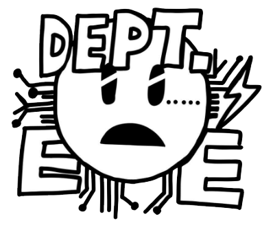

# HALLO, DIE WELT!

> Seeking what is true is not seeking what is desirable. If in order to elude the anxious question: ‘What would life be?’ one must, like the donkey, feed on the roses of illusion, then the absurd mind, rather than resigning itself to falsehood, prefers to adopt fearlessly Kierkegaard’s reply: ‘despair'.
> *-Albert Camus, The Myth of Sisyphus and Other Essays*

## Introduction
- **Name:** Yeongyoo Jo (조영유, 趙永濡), Christopher
- **Pronoun:** ~~oppa~~ he/him 
- **Birth:** 08/Jun/2000
- **Language:** Korean(Mother Language), English, Deutsch(Learning)

### Opened Personal Space

You can learn various well-arranged knowledges and skills what I learned, especially machine learning.
The English translation will be updated soon.

### Contact

    

**⚠️CAUTION⚠️:** Formally, I receive check the mail with using account , and  is used to connect google-related accounts. Please contact me with the email URL   if you wish a rapid response.

## Belongings
### Education
<a href= "https://www.inha.ac.kr/kr/index.do">
<h3 align="center">${\color{#00AFEC}INHA} {\color{#005bac}UNIVERSITY}$</h3>
</a>
<table align="center">
  </tr>
  <tr>
   <td align = "center" >
   <b>MAJOR</b>
   </td>
   <td align = "center" >
   <b>MINOR</b>
   </td>
   <td align = "center" >
   <b>STATUS</b>
   </td>
  </tr>
  <tr>
   <td align = "center" >
     
    Electronics Engineering
   </td>
   <td align = "center" >
    
   Philosophy
   </td>
   <td>
   Senior (2019~)
   </td>
  </tr>
</table>

### Current

<table align="center">
  </tr>
  <tr>
   <td align="center">
     
   SEA:ME  
   Contributor  
   (2024.6~)
   </td>
  </tr>
</table>

### Previous
> with sincere gratitude for the ways it has helped me grow

<table align="center">
  </tr>
  <tr>
   <td align="center"'>
     
   DSP Lab, Inha Univ  
   Intern  
   (2023.6~2023.8)
   </td>
   <td align="center">
     
   CVIP Lab, Inha Univ  
   Intern  
   (2024.1~2024.6)
   </td>
  </tr>
</table>

## Tech Stack

### Programming Language
 
  
 
 
 

### Machine Learning related

### Application development related

### OS and Embedded System related

### etc

### current learning....
Algorithm....
Deutsch....

